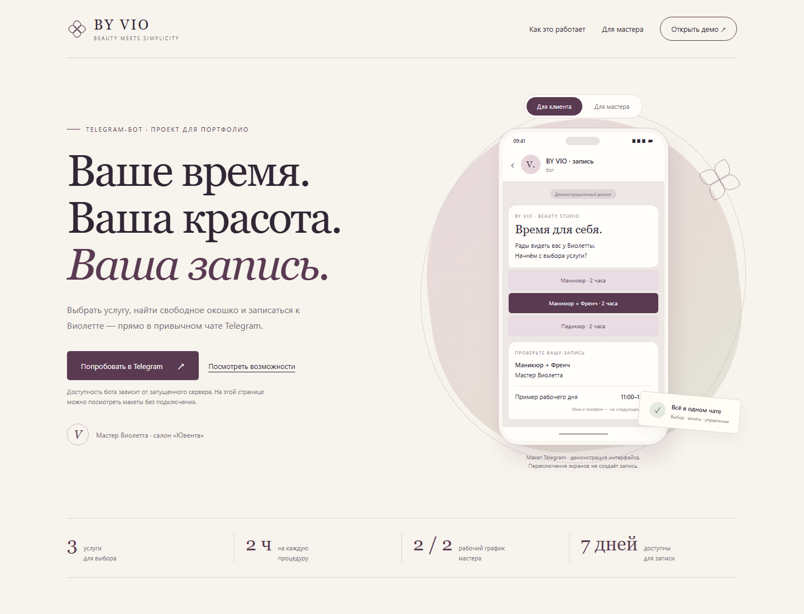
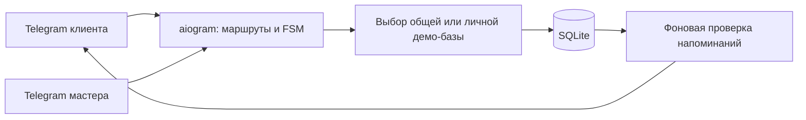

# BY VIO · Запись в салон через Telegram

[](https://github.com/Deshead/by-vio-booking-bot/actions/workflows/ci.yml)

Портфолио-проект на Python и aiogram: клиент выбирает услугу и свободное время, подтверждает запись и управляет визитами прямо с телефона. Мастер получает расписание, карточки клиентов и управление рабочими днями.

**[Открыть бота](https://t.me/vl_booking_demo_bot)** · [Кейс](docs/CASE_STUDY.md) · [Размещение](docs/DEPLOYMENT.md) · [Сайт проекта](https://deshead.github.io/by-vio-booking-bot/)

Мастер Виолетта · салон «Ювента» · 88005553535.



## Возможности

- Запись: услуга → мастер → дата → время → имя и телефон → подтверждение.
- «Мои записи»: карточки предстоящих визитов, история, перенос и отмена с подтверждением.
- Свободные окна учитывают продолжительность, график 2/2, занятые интервалы и закрытые дни.
- Перенос сохраняет прежнее время до успешного подтверждения нового. Повторное нажатие не создаёт дубль.
- Напоминания в Telegram в течение двух часов перед визитом, если клиент включил их при подтверждении.
- Кабинет мастера: сегодня, завтра, ближайшая неделя, загрузка, карточки клиентов, отмена, закрытие/открытие рабочих дней и экспорт CSV.
- Отдельный демонстрационный салон для каждого посетителя и кнопка «✨ Пример записей».
- SQLite, миграции базы, защита от запуска второй копии, ротация логов и контейнерный запуск.

## Попробовать за две минуты

1. `/start` → «✨ Пример записей» → «📋 Мои записи».
2. Откройте карточку, перенесите визит и проверьте новую дату.
3. Отмените второй визит и найдите его в истории.
4. Откройте кабинет мастера: расписание, загрузка, CSV и рабочие дни.
5. «📝 Записаться» → пройдите самостоятельную запись до подтверждения.

Доступность бота зависит от запущенного сервера. Презентационная страница показывает интерфейс и сценарии отдельно от Telegram.

## Демо и настоящий салон

По умолчанию `DEMO_MODE=true`: каждый посетитель получает свою базу и кабинет мастера **своего** демо. Его записи не занимают время у других посетителей. Примеры содержат вымышленные имена и номер, напоминания для них выключены. В сообщениях явно указано, что запись пробная.

Для настоящего салона установите `DEMO_MODE=false` и `ADMIN_IDS=123456789` — Telegram ID мастера из команды `/myid`. Можно перечислить несколько ID через запятую. Клиенты пользуются общим расписанием, кабинет доступен только указанным ID. Демо-базы и рабочая база разделены; переключение режима не переносит записи между ними.

## Локальный запуск

Нужен Python 3.14. Из папки проекта на Windows:

```powershell
python -m venv .venv
.\.venv\Scripts\python.exe -m pip install -r requirements.txt
```

Если своего `.env` ещё нет, скопируйте пример:

```powershell
Copy-Item .env.example .env
```

Впишите `BOT_TOKEN` от BotFather и запустите:

```powershell
.\.venv\Scripts\python.exe -X utf8 bot.py
```

Также можно открыть `start.bat`. После сообщения о подключении отправьте боту `/start`. При ручном запуске окно должно оставаться открытым. Остановка — `Ctrl+C`.

**Для работы при выключенном компьютере нужен сервер.** В репозитории готовы Docker и Compose для постоянного запуска на VPS: [инструкция размещения](docs/DEPLOYMENT.md). Наличие конфигурации само по себе не означает, что бот уже размещён.

## График и услуги

Маникюр, маникюр + Френч и педикюр — по 2 часа. Виолетта работает с 09:00 до 18:00 по Новосибирску (UTC+7), два дня через два. 25–26 сентября 2026 года — выходные, 27–28 — рабочие. Цикл продолжается от этой фиксированной даты и не сдвигается при перезапуске.

Клиент видит ближайшие 7 дней, включая сегодня. Начало визита предлагается с шагом час, с 09:00 до 16:00; занятые и прошедшие интервалы исключены. Дополнительно мастер может закрыть рабочий день без подтверждённых записей, затем снова открыть его. Базовые выходные 2/2 остаются выходными.

Каталог и расписание находятся в `app/catalog.py`: `SERVICES`, `MASTERS`, `WORK_CYCLE_START`, `BOOKING_DAYS`. Часовой пояс задан явно. Стоимость услуг не указана: прайс не предоставлен.

## Архитектура и данные



- Рабочая база: `data/bookings.sqlite3`. Демонстрационные: `data/demo/user_<id>.sqlite3`.
- `BOOKING_DB_PATH` задаёт путь рабочей базы; каталог демо расположен рядом. В контейнере используется постоянный том `/data`.
- Проверка пересечений и сохранение выполняются одной транзакцией. Проверяются владелец записи и её версия. Отмена освобождает время, сохраняя историю.
- Подтверждённые записи переживают перезапуск. Незавершённую форму нужно начать заново: её состояние находится в памяти.
- `/cancel` выходит из оформления; отмена подтверждённого визита выполняется в «Моих записях».
- Напоминания проверяются раз в минуту. После простоя отправляются только актуальные напоминания о предстоящем визите. Доставка зависит от Telegram; при блокировке бота пользователем сообщение не доставляется.
- Используется одна копия polling-процесса на токен. Локальная блокировка предотвращает второй запуск из той же папки; при переходе в облако компьютерную копию нужно остановить.

Резервная копия баз без остановки бота:

```powershell
.\.venv\Scripts\python.exe scripts/backup.py --data-dir data --output-dir backups
```

Для восстановления остановите бот и замените нужную базу копией. Бэкапы содержат контактные данные и не публикуются с проектом.

## Конфигурация

| Переменная | Назначение |
|---|---|
| `BOT_TOKEN` | Токен BotFather; обязателен, хранится вне исходников |
| `DEMO_MODE` | `true` — личные демо, `false` — общий салон |
| `ADMIN_IDS` | ID мастеров через запятую для рабочего режима |
| `BOOKING_DB_PATH` | Путь базы; по умолчанию `data/bookings.sqlite3` |
| `BOT_PROXY_URL` | Пусто — системный прокси; `direct` — напрямую; либо URL прокси |
| `PORT` | HTTP `/health`; `0` отключает, контейнер использует `8080` |

Команды: `/start`, `/book`, `/my`, `/services`, `/help`, `/cancel`, `/myid`, `/admin`, `/admin_export`, `/demo`.

## Проверки

```powershell
.\.venv\Scripts\python.exe -X utf8 -m unittest discover -s tests -v
```

Тесты не обращаются к Telegram и используют временные базы. Проверяются расписание, конкурентная запись, миграции, сообщения и кнопки, отмена, перенос, роли, изоляция демо, напоминания и единственный экземпляр. GitHub Actions проверяет проект на Linux и Windows; отдельный workflow публикует только папку `portfolio` в GitHub Pages.

## Диагностика

`bot.log` содержит запуск и ошибки, автоматически ротируется. Не публикуйте `.env`, базы и логи. На Windows используется системный прокси, если он настроен; программа этого прокси должна работать. На сервере по умолчанию используется прямое соединение.

Если бот не отвечает: проверьте журнал, запуск через `.venv\Scripts\python.exe` и отсутствие другой копии с тем же токеном. При сообщении «Бот уже запущен» остановите прежний процесс. Файл `.bot.lock` удалять не нужно: блокировка освобождается при завершении процесса. Изменения кода применяются после перезапуска.

```text
bot.py                 запуск, маршруты, polling и фоновые задачи
app/catalog.py         услуги и график
app/handlers/          клиентские сценарии и кабинет мастера
app/keyboards/         клавиатуры Telegram
app/storage.py         SQLite и транзакции
app/store_provider.py  разделение demo / salon
app/reminders.py       напоминания
app/health.py          состояние запуска для хостинга
tests/                автономные тесты
docs/                 размещение и кейс
portfolio/            презентация проекта
```
